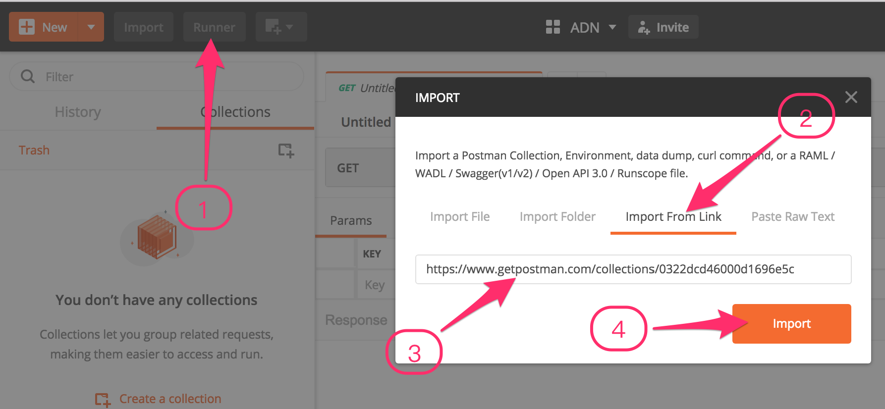

# Autodesk View & Data API Postman Collection

An AutodeskView & Data API postman collection, environment with JetPacks support.

Demonstrates the Autodesk View & Data API authorisation and translation process using a Postman Collection.

## Description

The view.and.data.api.postman collection exercises the Postman tool to demonstrate the Autodesk View and Data API
authorisation and translation process mentioned in the Quick Start guide.

It closely follows the steps described in the documentation:
* http://developer.api.autodesk.com/documentation/v1/vs_quick_start.html

In order to make use of this sample, you need to register your consumer key, of course:
* https://developer.autodesk.com > My Apps

This provides the credentials to supply to the HTTP command arguments.

## Motivation

What do you think about setting up the Chrome Postman tool that does nothing but executes the REST calls provided in 
the quick start documentation?

That would presumably help developers debugging their processes quickly.

## Postman and setup

### Installation

Postman is a Google Chrome App that allows you to quickly use and test API calls with our system, with features that 
help to streamline and optimized your calls, as well as inspecting server responses.

To download Postman, simply follow [this link](https://chrome.google.com/webstore/detail/postman-rest-client-packa/fhbjgbiflinjbdggehcddcbncdddomop?hl=en)
and click on “Add to Chrome”.

To launch Postman, open your chrome apps by clicking on the button to the left of the browser.

If the button isn’t there, you can use the ‘cmd-shift-B’ shortcut on OSX, and the ‘ctrl-shift-B’ shortcut on Windows.

Then, click on the Postman icon to launch the app.

Postman will then open in a new window, ready to set up an environment.

### Environment

Setting up an environment allows us to easily use environmental variables, which will make calling to the API easier, and quicker.
To do so, we click the downward arrow next to ‘No environment and select ‘Manage environments'

At the next window that opens, click ‘Import’.

And use this url to import the environment: https://raw.githubusercontent.com/Developer-Autodesk/view.and.data.api.postman/master/Autodesk%20View%20%26%20Data%20API%20Production%20Server.postman_environment

Next, click the 'Back' button, and then select the 'Autodesk View & Data API Production Server' link.

Finally, enter your Autodesk View & Data API keys, and click 'Submit'.

### Collection

Postman uses collections, which can be used to add groups of API calls in order to automate the process of using/testing a REST API.
This official Autodesk View & Data API Postman collection is to help get you to test and debug the API easily.

To set up Postman with the Autodesk View & Data API collection, make sure that you are on the collection tab on the left, and click ‘Import collection'

Choose 'Download from link', and copy the URL below, then hit the 'Import' button.
https://www.getpostman.com/collections/14e42c06b5f44aa2f88f

You should get something like this: 

Note: This collection is setup to use 'Postman JetPacks' if you got a license, but you can use that collection without JetPacks too. To
buy Jetpacks, simply click on the 'Tests' tab of any API call definition.

## Using Postman

Using Postman with the Autodesk View & Data API is working like if you were making many manual HTTP requests, only easier. 
Lets go through some example API calls so that you can get a feel for how it works with Postman.

  1. Authenticate

      Before we can use the API, you need to get an access token (credential). The API will confirm that your application is a legitimate 
	  application by matching your consumer key and secret with the oAuth2 server, and return with an access token if you are successfully
	  authorized. 
	  This access token will be sent in the header of all subsequent calls to the API. This token will automatically expire after 30 minutes, 
	  so you may have to renew the token every 30 minutes or if you got an expire message in one of the following call.
      
	  * To get an access token, expand the 'Authentication' folder under the Collections tab, and select the 'oAuth 2 - Token Request' call (<b>1</b>).
	  * Press the 'Send' button (<b>2</b>).
	  * In the response window, you will get the server reply which contains your access token (<b>3</b>). If you are using the 'JetPacks' extension,
	    you do not not need to worry about chaining the call, JetPacks will automatically save the access token in your environment variables, as well 
		as running the tests suite to validate the response (<b>5</b>). However, if you do not have 'JetPacks' installed, you need to select the bearer
		string, right-click, and store it in the 'Bearer' variable like shown in (<b>4</b>).
		
		
		
		All the API definitions work the same way whether they are POST, GET, PUT or HEAD. The rest of this chapter will only concentrate on 
		telling you what value to save in which variable to chain calls. If you are using 'JetPacks', bail now, it is done automatically.
	  
  2. OSS - Bucket Creation

      Save  'key' in variable 'BucketName'
	  
  3. Any of the 'OSS - Upload *'

      Save  'id' in variable 'URN' 
	  Copy the 'id' value, go to this [website](https://www.base64encode.org/) to encode the string, and save the result into variable 'base64URN'
	  
  4. Create Reference
  
      In this one you need to edit the 'request body', you need to understand the reference system to edit the request body appropriately. Read
	  the following [blog article](http://adndevblog.typepad.com/cloud_and_mobile/2015/07/how-to-set-references-with-revit-files-for-view-and-data-api.html) 
	  to get some explanations in addition to the documentation.
	  
	  
	  
	  
	  
	  
	  
	  
	  
	  
	  
--------

## License

This sample is licensed under the terms of the [MIT License](http://opensource.org/licenses/MIT). Please see the [LICENSE](LICENSE) file for full details.

## Written by

Cyrille Fauvel (Autodesk Developer Network) 
http://www.autodesk.com/adn 
http://around-the-corner.typepad.com/ 
