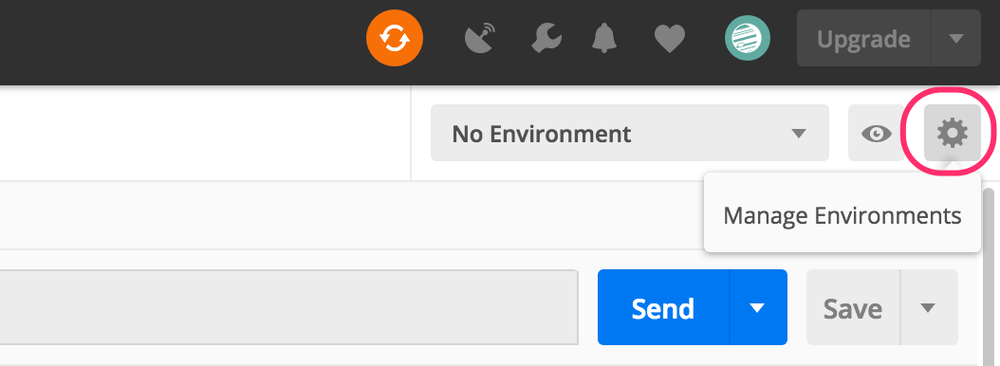
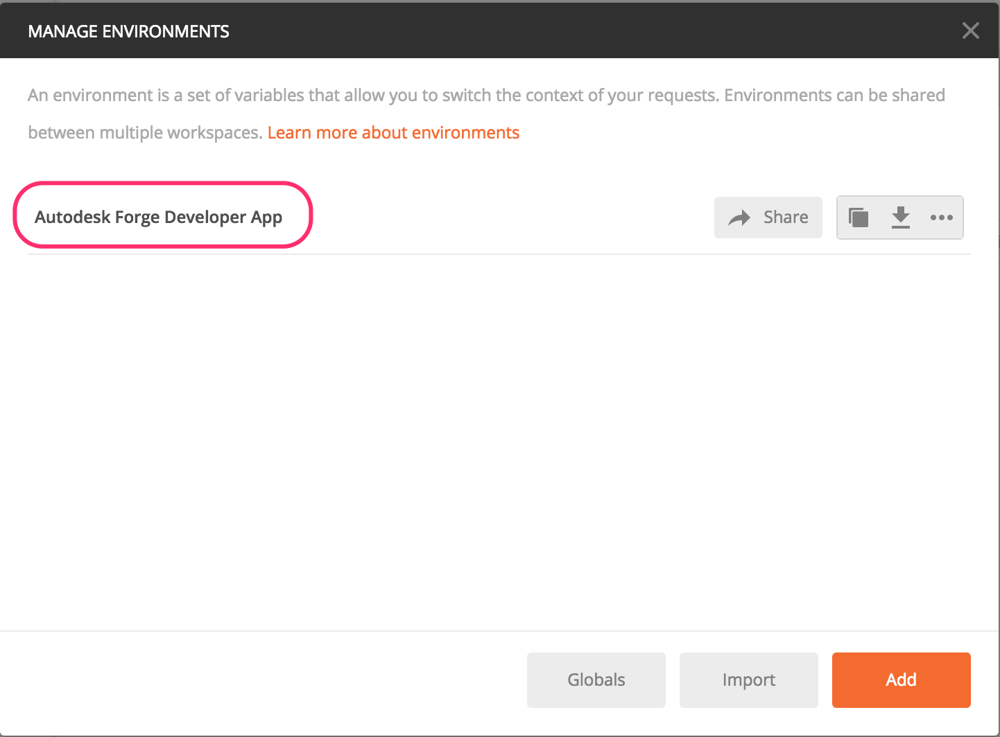
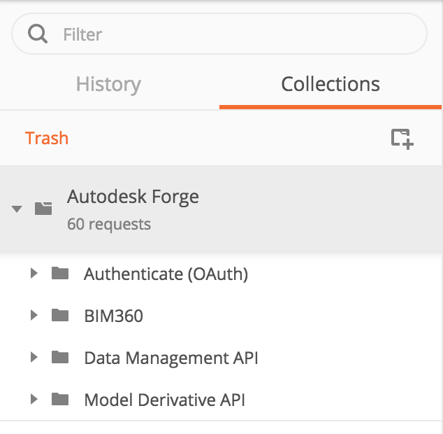

## Autodesk Forge Platform APIs Postman Collection

*Forge API*: 

**Note:** For using this sample, you need a valid oAuth credential for the translation / extraction portion. Visit those pages ( [oAuth2](https://developer.autodesk.com/en/docs/oauth/v2/tutorials/), [Data Management](https://developer.autodesk.com/en/docs/data/v2/tutorials/), [Model Derivative](https://developer.autodesk.com/en/docs/model-derivative/v2/tutorials/) and [BIM360](https://forge.autodesk.com/en/docs/bim360/v1/overview/introduction/) ) for instructions to get on-board. **The BIM360 Collection contains Data Management API for BIM360 and BIM360 HQ API**

## Motivation

To facilitate understanding the Forge API and help developers to debug their process quickly, this repository is presenting the setup for Postman tool, which executes the REST calls provided in the [Autodesk Forge Platform](https://developer.autodesk.com).

## Description

An Autodesk Forge API postman collection, environment with JetPacks support, demonstrating the Autodesk Forge Platform APIs authorization and translation process using a Postman Collection.

If you know Postman already, here are the 2 components you need:

* [Autodesk Forge Platform APIs Postman Environment for Developer Own OSS bucket](autodesk.forge.developer.app.postman_environment.json)

* [Autodesk Forge Platform APIs Postman Environment for BIM360](autodesk.forge.bim360.intge.postman_environment.json)

* [Autodesk Forge Platform APIs Postman Collection](https://www.getpostman.com/collections/0322dcd46000d1696e5c8dddbf02e279be1279e4)

This repository exercises the Postman tool to demonstrate the Autodesk Forge Platform APIs
authorization and translation process mentioned in those pages ( [oAuth2](https://developer.autodesk.com/en/docs/oauth/v2/tutorials/), [Data Management](https://developer.autodesk.com/en/docs/data/v2/tutorials/), [Model Derivative](https://developer.autodesk.com/en/docs/model-derivative/v2/tutorials/) and [BIM360](https://forge.autodesk.com/en/docs/bim360/v1/tutorials/) ).

In order to make use of this sample, you need to register your consumer key by going to ***[https://forge.autodesk.com > My Apps](https://forge.autodesk.com/myapps)***, thus getting the credentials necessary for HTTP command arguments.

## Postman and setup

### Installation

Postman is a native App that allows you to quickly use and test API calls with our system, with features that help to streamline and optimized your calls, as well as inspecting server responses.

To download Postman, simply follow [this link](https://www.getpostman.com/apps).

## Environment setup

Setting up an environment allows us to easily use environmental variables, which will make calling to the API easier, and quicker.
To do so, we click the downward arrow next to ‘No environment and select ‘Manage environments' 

At the next window that opens, click ‘Import’. 

And either choose the file ***forge.api.postman_environment.json*** from the repository or download it directly from [hre](autodesk.forge.developer.app.postman_environment.json) and [here](autodesk.forge.bim360.intge.postman_environment.json).

Next, click on 'Autodesk Forge API Production Server' link to enter the edit mode:

Finally, enter your Autodesk Forge API keys, and click 'Update'.

## Collection 

Postman uses collections, which can be used to add groups of API calls in order to automate the process of using/testing a REST API.
This unofficial ***Autodesk Forge Platform APIs Postman Collection*** is to help get you to test and debug the API easily.

To set up Postman with the ***Autodesk Forge Platform APIs Postman Collection***, make sure that you are on the collection tab on the left, and click ‘Import':

Choose 'Import From Link', and copy the URL below, then hit the 'Import' button.
https://www.getpostman.com/collections/0322dcd46000d1696e5c8dddbf02e279be1279e4

You should get something like this:

Note: This collection is setup to use 'Postman JetPacks' if you got a license, but you can use that collection without JetPacks too. To
buy Jetpacks, simply click on the 'Tests' tab of any API call definition.

## Using Postman

**Note**: Before continuing, don't forget to set your environment to the one imported above:

 

Using Postman with the Autodesk Forge Platform APIs is working like if you were making many manual HTTP requests, only easier. 
Lets go through some example API calls so that you can get a feel for how it works with Postman.

  1. Authenticate

      Before we can use the API, you need to get an access token (credential). The API will confirm that your application is a legitimate 
	  application by matching your consumer key and secret with the oAuth2 server, and return with an access token if you are successfully
	  authorized. 
	  This access token will be sent in the header of all subsequent calls to the API. This token will automatically expire after 30 minutes, 
	  so you may have to renew the token every 30 minutes or if you got an expire message in one of the following call.
      
	  * To get an access token, expand the 'Authentication' folder under the Collections tab, and select the 'Two Legged - Token Request' call (<b>1</b>).
	  * Press the 'Send' button (<b>2</b>).
	  * In the response window, you will get the server reply which contains your access token (<b>3</b>).  
	    <b>If you are using the 'JetPacks' extension,</b> you do not not need to worry about chaining the call, JetPacks will automatically save 
		the access token in your environment variables, as well as running the tests suite to validate the response (<b>5</b>).  
		<b>However, if you do not have 'JetPacks' installed</b>, you need to select the bearer string, right-click, and store it in the 'Bearer' variable 
		like shown in (<b>4</b>).
		
		
		
		All the API definitions work the same way whether they are POST, GET, PUT or HEAD. The rest of this chapter will only concentrate on 
		telling you what value to save in which variable to chain calls. If you are using 'JetPacks', bail now, it is done automatically.
	  
  2. Data Mgmt - Bucket Creation

      Save  'key' in variable 'BucketName'
	  
  3. Data Mgmt - Upload a file
  
      Before calling the API, edit the 'Filename' variable to put the name of the file you're uploading.

      Save  'id' in variable 'URN' 
			Copy the 'id' value, go to this [website](https://www.base64encode.org/) to encode the string, and save the result into variable 'base64URN'.

  4. Request Model Translation and check Translation Status

--------

## License

This sample is licensed under the terms of the [MIT License](http://opensource.org/licenses/MIT). Please see the [LICENSE](LICENSE) file for full details.

## Written by

Eason Kang [@yiskang](https://twitter.com/yiskang)  
Autodesk Developer Network & Forge Partner Development  
https://developer.autodesk.com/  
https://forge.autodesk.com/blog  

## Concepts from
Cyrille Fauvel (Autodesk Developer Network) 
[http://www.autodesk.com/adn](http://www.autodesk.com/adn) 
[http://around-the-corner.typepad.com](http://around-the-corner.typepad.com) 